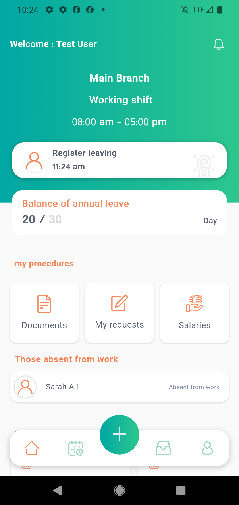
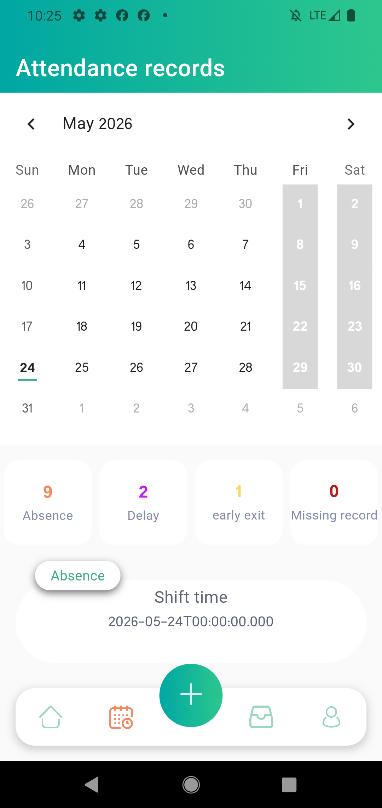
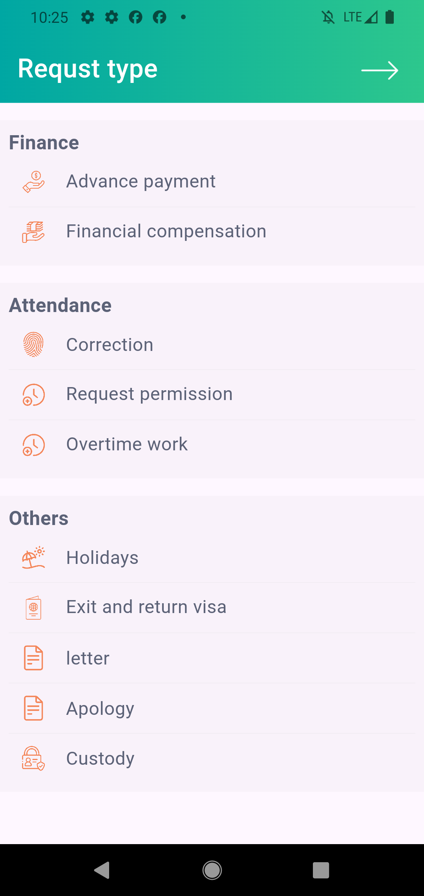
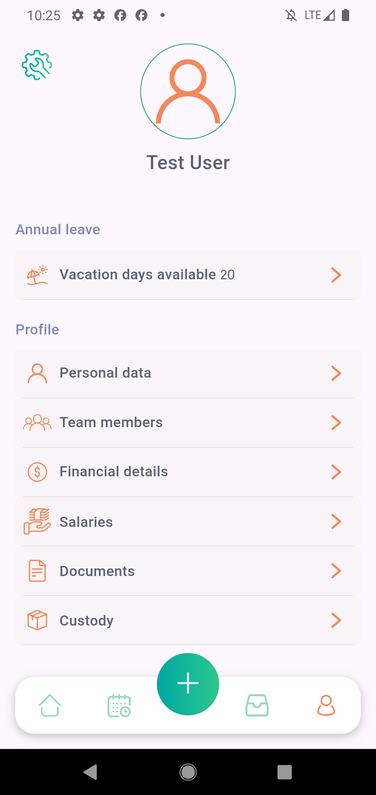

# Wassl

Wassl is a comprehensive HR management mobile application built with Flutter. It streamlines employee attendance tracking, leave/vacation management, financial requests, and team coordination.

> **Note:** The app currently uses **mock data** for all features. No backend connection is required.

## Screenshots

<div align="center">
  
  
  
  
  
</div>

## Features

### Authentication
- Login with email and password
- Remember-me with saved credentials
- Auto-login on app restart
- Logout and password change

### Home Dashboard
- Current work shift info (time-in, time-out, shift title)
- Attendance check-in/check-out
- Branch name display
- Promotional ads carousel
- Upcoming events list
- Vacation balance overview

### Attendance
- Monthly attendance calendar with day-by-day status
- Attendance statistics (absences, late arrivals, early leaves)
- Team attendance view
- Check-in / check-out with location-based validation

### Orders
- 10+ order types: leave requests, loans, letters, permissions, overtime, custody, visa, fingerprint correction, financial expenses, travel requests
- My orders list with status filtering
- Team orders management (approve/reject)
- File attachments on orders
- Pagination

### Finance
- Salary details per month
- Salary history listing
- Net salary breakdown

### Vacations
- Vacation balance (opening, used, available, sick, unpaid)
- Incoming approved vacations
- Previous vacation history

### Profile
- User profile information
- Team members directory

## Architecture

The app uses **Clean Architecture** with a **feature-first** folder structure, organized into three layers:

```
lib/
├── core/              # Shared infrastructure
│   ├── di/            # Dependency injection (GetIt)
│   ├── error/         # Failures, exceptions, Result type
│   ├── network/       # API client (Dio), endpoints, network info
│   └── bridge/        # Bloc-to-GetX sync bridge
│
├── features/          # Feature modules (Clean Architecture)
│   ├── auth/          # Authentication
│   ├── attendance/    # Attendance tracking
│   ├── finance/       # Salary & finance
│   ├── home/          # Dashboard, ads, events
│   ├── notifications/ # Push notifications
│   ├── orders/        # All order types
│   ├── profile/       # User profile
│   └── vacations/     # Vacations & holidays
│       ├── data/          # Data sources (remote/local/mock), repositories
│       ├── domain/        # Entities, repository interfaces, use cases
│       └── presentation/  # Cubits, pages, widgets
│
├── views/             # Legacy page structure (GetX)
├── models/            # Legacy data models (GetX)
└── getx_controllers/  # Legacy GetX controllers
```

### Layer Details

**Domain Layer** — Inner layer with no dependencies:
- Entities (business objects)
- Repository interfaces (contracts)
- Use cases (business logic)

**Data Layer** — Implements domain contracts:
- Remote data sources (Dio-based API calls)
- Local data sources (SharedPreferences)
- Mock data sources (in-memory for testing)
- Repository implementations

**Presentation Layer** — UI & state management:
- Cubits (Bloc) for state management
- Pages and widgets
- All logic driven by use cases

## State Management

The app uses a **dual state management** approach during migration:

| Approach | Used For | Status |
|---|---|---|
| **GetX** | Legacy pages and controllers | Existing (being migrated) |
| **Bloc / Cubit** | New feature modules | Active development |

A **BlocToGetxSync** bridge syncs Bloc state back to GetX controllers, allowing gradual migration without breaking existing views.

### Cubit States (Sealed Class Pattern)

Every cubit uses Dart sealed classes with `part of`:

```dart
part of 'auth_cubit.dart';

sealed class _AuthState {}
final class AuthInitial extends _AuthState implements AuthState {}
final class AuthLoading extends _AuthState implements AuthState {}
// ...
```

## Dependency Injection

All dependencies are registered via **GetIt** in `lib/core/di/injection_container.dart`:

```dart
await initDependencies(useMocks: true);  // Mock mode
await initDependencies(useMocks: false); // Real API mode
```

The container registers:
- **Core services:** SharedPreferences, NetworkInfo, Dio, ApiClient
- **Data sources:** Remote + Mock implementations per feature
- **Repositories:** One per feature, wired to data sources
- **Use cases:** Auth (login, logout, change password, etc.)
- **Cubits:** All feature cubits

## Mock Data

The app runs entirely on mock data — no backend required. To log in:

| Email | Password | Result |
|---|---|---|
| `test@waslhr.com` | `1234567` | Successful login |

Mock data sources are in each feature's `datasource/` directory:
- `MockAuthRemoteDataSource` — Login/logout/password change
- `MockHomeRemoteDataSource` — Ads, events
- `MockAttendanceRemoteDataSource` — Monthly attendance, team, check-in
- `MockOrdersRemoteDataSource` — Order types, CRUD
- `MockFinanceRemoteDataSource` — Salary details
- `MockVacationsRemoteDataSource` — Vacation balance & history
- `MockProfileRemoteDataSource` — Profile update

## Getting Started

### Prerequisites

- Flutter SDK 3.0+
- Dart 3.0+
- Android Studio / VS Code

### Installation

```bash
# Clone the repository
git clone https://github.com/your-username/wassl.git
cd wassl

# Install dependencies
flutter pub get

# Run the app (mock mode - no backend needed)
flutter run
```

### Running with Real API

```dart
// In lib/main.dart, line 25:
await di.initDependencies(useMocks: false);
```

## Tech Stack

| Technology | Purpose |
|---|---|
| **Flutter** | Cross-platform UI framework |
| **Dart** | Programming language |
| **Bloc / Cubit** | State management (new code) |
| **GetX** | State management (legacy code) |
| **GetIt** | Dependency injection |
| **Dio** | HTTP client |
| **SharedPreferences** | Local storage |
| **Geolocator** | Location services |
| **Firebase Messaging** | Push notifications |
| **flutter_local_notifications** | Local notifications |
| **table_calendar** | Calendar widget |
| **file_picker** | File selection |
| **flutter_pdfview** | PDF viewing |
| **url_launcher** | Opening external links |

## Project Structure

```
lib/
├── main.dart                          # App entry point
├── core/
│   ├── bridge/bloc_to_getx_sync.dart  # State sync bridge
│   ├── di/injection_container.dart    # GetIt DI setup
│   ├── error/
│   │   ├── exceptions.dart           # Core exceptions
│   │   ├── failures.dart             # Failure classes
│   │   └── result.dart               # Result<T> type
│   └── network/
│       ├── api_client.dart           # Dio-based API client
│       ├── api_endpoints.dart        # All API URLs
│       └── network_info.dart         # Connectivity
├── features/
│   ├── auth/
│   │   ├── data/datasource/          # Remote, local, mock data sources
│   │   ├── data/repositories/        # Auth repo implementation
│   │   ├── domain/entities/          # UserEntity, TokenEntity, etc.
│   │   ├── domain/repositories/      # AuthRepository interface
│   │   ├── domain/usecases/          # Login, logout, change password
│   │   └── presentation/cubit/       # AuthCubit + AuthState
│   ├── attendance/                   # Same structure
│   ├── finance/                      # Same structure
│   ├── home/                         # Same structure
│   ├── orders/                       # Same structure
│   ├── profile/                      # Same structure
│   └── vacations/                    # Same structure
├── getx_controllers/                 # Legacy GetX controllers
│   ├── app_controller.dart           # Main app controller
│   ├── attendance/                   # Attendance controllers
│   ├── calendar/                     # Calendar controller
│   ├── finance/                      # Finance controllers
│   ├── home/                         # Home controller
│   └── orders/                       # Order controllers
├── models/                           # Legacy data models
├── views/                            # Legacy UI pages
│   └── pages/
│       ├── auth/                     # Login page
│       ├── intro/                    # Splash screen
│       ├── main_tabs_page.dart       # Main navigation
│       ├── orders/                   # Order pages
│       ├── profile/                  # Profile pages
│       ├── settings/                 # Settings pages
│       └── ...                       # Other pages
└── web_services_helper/              # Legacy API helpers
    ├── api.dart                      # HTTP handler
    └── urls.dart                     # URL constants

test/
└── features/
    └── auth/                         # Auth tests (13 tests)
        ├── data/repositories/
        ├── domain/usecases/
        └── presentation/cubit/
```

## Testing

```bash
# Run all auth tests
flutter test test/features/auth/

# Run all tests (add more as features are implemented)
flutter test
```

### Current Test Coverage

| Feature | Tests | Status |
|---|---|---|
| Auth — Use Cases | 6 | ✅ Passing |
| Auth — Repository | 2 | ✅ Passing |
| Auth — Cubit | 5 | ✅ Passing |

## Contributing

1. Fork the repository
2. Create a feature branch (`git checkout -b feature/amazing-feature`)
3. Commit your changes (`git commit -m 'Add amazing feature'`)
4. Push to the branch (`git push origin feature/amazing-feature`)
5. Open a Pull Request

## License

This project is licensed under the MIT License.
